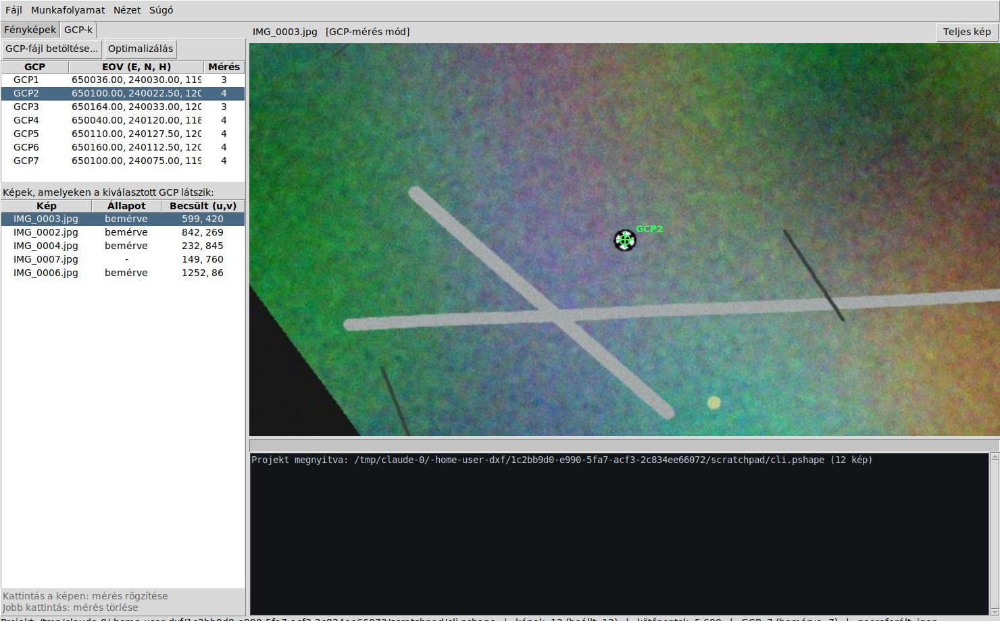

# PyShape — nyílt fotogrammetriai munkafolyamat (Metashape-szerű) Pythonban

A PyShape egy önálló, tisztán Python alapú fotogrammetriai program, amely az
Agisoft Metashape alap-munkafolyamatát valósítja meg drónos / légi
felmérésekhez, **EOV (EPSG:23700)** vetületi rendszerben:

1. **Képek betöltése** — EXIF GPS kiolvasása, WGS84 → EOV transzformáció
2. **Align photos** — SIFT jellemzőpontok, inkrementális Structure-from-Motion,
   ritka kötegelt kiegyenlítés (bundle adjustment) önkalibrációval
3. **Georeferálás** — Helmert-transzformáció a kamera-GPS pozíciókból
4. **GCP-k betöltése fájlból** és **kézi azonosítása**: a GCP-listából egy
   pontot kiválasztva a program listázza azokat a képeket, amelyeken a pont
   látszik, a becsült képi hellyel; kattintással rögzíthető a mérés
5. **Kamerák optimalizálása** — GCP-kényszeres kötegelt kiegyenlítés
6. **Dense cloud** — kalibrált sztereópárok, SGBM mélységtérképek,
   több-partneres medián-fúzió konzisztencia-szűréssel
7. **Mesh / DSM** — robusztus felszínmodell + 2.5D TIN mesh (PLY)
8. **Orthofotó** — DSM-alapú ortorektifikáció súlyozott képkeveréssel,
   **GeoTIFF export** EPSG:23700-ban (+ DSM GeoTIFF)



## Telepítés

```bash
pip install -r requirements.txt
```

Python 3.10+ szükséges; a GUI a beépített tkintert használja (Linuxon:
`sudo apt install python3-tk`). GPU nem szükséges.

## Grafikus felület

```bash
python -m pyshape gui                 # vagy: python -m pyshape
python -m pyshape gui munka.pshape    # meglévő projekt megnyitása
```

A **Munkafolyamat** menü sorrendben végigvezet a lépéseken. A GCP-méréshez:

1. `4. GCP-k betöltése fájlból...` — a fájl formátuma soronként
   `nev;E;N;H` (pontosvessző, vessző, tab vagy szóköz elválasztóval, `#`
   kommentek megengedettek)
2. a **GCP-k** fülön válassz egy pontot → alul megjelenik a **képlista**,
   amelyeken a pont látszik (align + georeferálás után)
3. duplakattintás egy képre → a néző a becsült helyre ugrik (sárga kereszt),
   **kattintás** = mérés rögzítése (zöld kereszt), **jobb kattintás** = törlés
4. legalább 3 GCP, egyenként legalább 2 képen bemérve → `Optimalizálás`

A néző: görgő = nagyítás, húzás = mozgatás. A **Nézet** menüből az elkészült
orthofotó és a DSM is megtekinthető.

## Parancssori használat (teljes pipeline)

```bash
python -m pyshape new munka.pshape --images fotok/
python -m pyshape align munka.pshape --quality high
python -m pyshape gcp-load munka.pshape gcps.csv
python -m pyshape gcp-measure munka.pshape meresek.csv   # gcp;kep;u;v sorok
python -m pyshape optimize munka.pshape
python -m pyshape dense munka.pshape --quality medium
python -m pyshape mesh munka.pshape
python -m pyshape ortho munka.pshape -o ortho.tif
python -m pyshape status munka.pshape
```

Ha a képekben nincs EXIF GPS, kamerapozíció-referencia adható meg:
`--reference ref.csv` (soronként `kepnev;E;N;H`). A GPS-magasság ellipszoidi;
GCP-k használatakor ez kiesik, egyébként a `--geoid-offset` opcióval
korrigálható (Magyarországon ~40–45 m).

## Kimenetek (a projektmappában)

| Fájl        | Tartalom                                   |
|-------------|--------------------------------------------|
| `dense.ply` | sűrű, színes pontfelhő (EOV-lokális)        |
| `mesh.ply`  | 2.5D TIN mesh csúcsszínekkel (EOV)          |
| `dsm.tif`   | felszínmodell GeoTIFF, EPSG:23700           |
| `ortho.tif` | RGBA ortomozaik GeoTIFF, EPSG:23700         |

## Önteszt

Szintetikus (ismert valóságú) légifelvétel-sorozaton futtatja végig a teljes
láncot és pontosságot ellenőriz:

```bash
python tools/selftest.py
```

Tipikus eredmény a szintetikus teszten (10 cm-es terepi felbontású képekkel):
GCP RMS ≈ 4 cm, dense cloud magassági MAE ≈ 11 cm, a GCP-jelek az orthofotón
a várt EOV-koordinátán jelennek meg.

## Korlátok (a Metashape-hez képest)

- Közel-nadír légi felvételezésre méretezett (a georeferálás feltételezi,
  hogy a terep a kamerák alatt van); ferde/körbeforgó felvételekhez nem ideális
- A mesh 2.5D (DSM-alapú TIN), nem általános 3D rekonstrukció
- A dense illesztés CPU-s SGBM, nem GPU-s multi-view PatchMatch — nagy
  projekteken lassabb és zajosabb, mint a Metashape
- Takarásvizsgálat nélküli ortomozaik (nadír képeknél ez ritkán gond)

---

*Megjegyzés: a repó `dxf-viewer.html` fájlja egy ettől független,
korábbi DXF-nézegető eszköz.*
